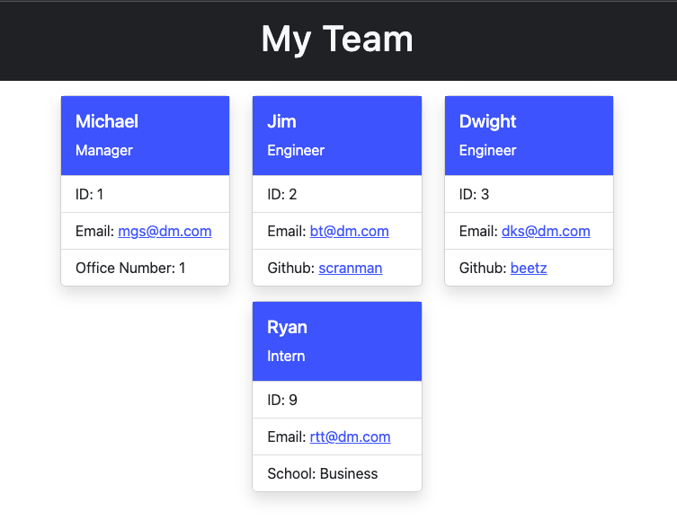

# Organization Directory

## Description
Use this application to create an organzation director inclusive of manager, employees, and interns.

## Screenshots
### Team Profile 

## Table of Contents
* [Installation Details](#install)
* [Usage Details](#usage)
* [Technologies](#technologies)
* [Credits](#credits)
* [Contributions](#contributions)
* [License](#license)
* [Tests](#tests)
* [Questions](#questions)

## Install
1. Clone this repo
2. npm i

## Usage
Invoke from the command line with
> node index

After answering all questions and selecting "Finished," view the output file: `team.html` in the `dist` folder.

## Technologies
* Bootstrap
* Node JS
* Jest
* Inquirer
* HTML

## Credits
Teaching Staff at UCLA and my tutor Jose Lopez

## Contributing
Issue a pull request to contribute to this project

## Tests
> npm test

## License Info
n/a

# Questions?

## Github Profile
[https://github.com/exzilium](https://github.com/exzilium)

## Email
[caseyjdwyer@gmail.com](mailto:caseyjdwyer@gmail.com)
